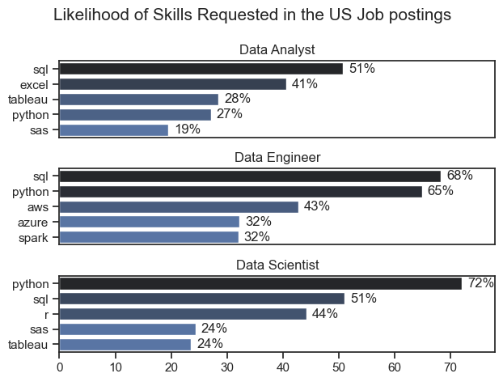
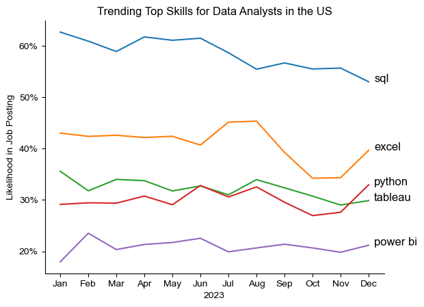
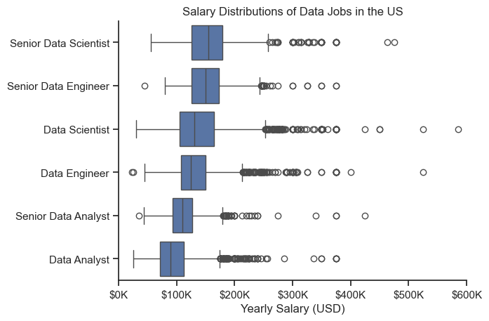
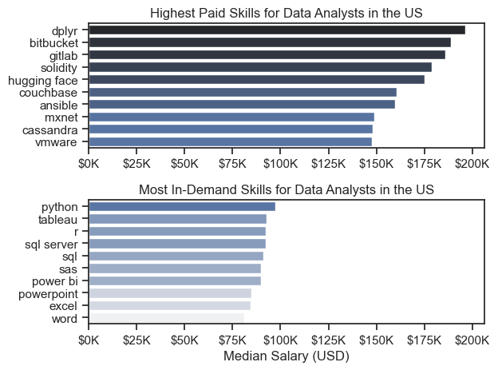
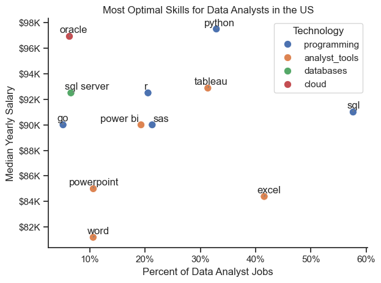

# Data Job Market Analysis

## Questions
1. What are the skills most in demand for the top 3 most popular data roles?
2. How are in-demand skills trending for Data Analysts?
3. How well do jobs and skills pay for Data Analysts?
4. What are the optimal skills for data analysts to learn?

## Tools I used
1. Python(Pandas, Matplotlib, Seaborn)
2. Jupyter Notebooks
3. Visual Studio Code
4. Git & GitHub

## Data Preparation and Cleanup
### Import & Clean Up Data
```python
# Importing Libraries
import pandas as pd
import matplotlib.pyplot as plt
import seaborn as sns
import ast


# Loading Data
df = pd.read_csv('/Users/viktoria/Desktop/python_data_project/data_jobs.csv')

# Data Cleanup
df['job_posted_date'] = pd.to_datetime(df['job_posted_date'])
df['job_skills'] = df['job_skills'].apply(lambda x: ast.literal_eval(x) if pd.notna(x) else x) 
```

### Filter US Jobs
```python
df_US = df[df['job_country'] == 'United States']
```
## 1. What are the most demanded skills for the top 3 most popular data roles?

View my notebook with detailed steps here: [skill_demand.ipynb](project/skill_demand.ipynb)

### Visualize Data

```python
fig, ax = plt.subplots(len(job_titles), 1)

sns.set_theme(style='ticks')

for i, job_title in enumerate(job_titles):
    df_plot = df_skills_perc[df_skills_perc['job_title_short'] == job_title].head()
    sns.barplot(data=df_plot, x='skill_percent', y='job_skills', ax=ax[i], hue='skill_count', palette='dark:b_r')
plt.show()
```
### Results


*Bar graph visualizing the salary for the top 3 data roles and their top 5 skills associated with each*

### Insights

- SQL is the most requested skill for Data Analysts and Data Scientists, with it in over half the job postings for both roles. For Data Engineers, SQL is the most sought-after skill, appearing in 68% of job postings.
- Data Engineers require more specialized technical skills (AWS, Azure, Spark) compared to Data Analysts and Data Scientists who are expected to be proficient in more general data management and analysis tools (Excel, Tableau).
- Python is a versatile skill, highly demanded across all three roles, but most prominently for Data Scientists (72%) and Data Engineers (65%).

## 2. How are in-demand skills trending for Data Analysts?

View my notebook with detailed steps here: [skills_trend.ipynb](project/skills_trend.ipynb)

### Visualize Data

```python

from matplotlib.ticker import PercentFormatter
df_plot = df_DA_US_percent.iloc[:, :5]
sns.lineplot(data=df_plot, dashes=False, legend='full', palette='tab10')
sns.set_theme(style='ticks')

plt.gca().yaxis.set_major_formatter(PercentFormatter(decimals=0))

plt.show()

```
### Results


*Bar graph visualizing the trending top skills for data analysts in the US in 2023*

### Insights

- SQL remains the most consistently demanded skill throughout the year, although it shows a gradual decrease in demand.
- Excel experienced a significant increase in demand starting around September, surpassing both Python and Tableau by the end of the year.
- Both Python and Tableau show relatively stable demand throughout the year with some fluctuations but remain essential skills for data analysts. Power BI, while less demanded compared to the others, shows a slight upward trend towards the year's end.


## 3. How well do jobs and skills pay?

View my notebook with detailed steps here: [salary_analysis.ipynb](project/salary_analysis.ipynb)

### Visualize Data
```python
sns.boxplot(data=df_US_top6, x='salary_year_avg', y='job_title_short', order=job_order)
ax = plt.gca()
ax.xaxis.set_major_formatter(plt.FuncFormatter(lambda x, pos: f'${int(x/1000)}K'))
plt.show()
```
### Results

*Box plot visualizing the salary distributions for the top 6 data job titles.*

### Insights
- There's a significant variation in salary ranges across different job titles. Senior Data Scientist positions tend to have the highest salary potential, with up to $600K, indicating the high value placed on advanced data skills and experience in the industry.

- Senior Data Engineer and Senior Data Scientist roles show a considerable number of outliers on the higher end of the salary spectrum, suggesting that exceptional skills or circumstances can lead to high pay in these roles. In contrast, Data Analyst roles demonstrate more consistency in salary, with fewer outliers.

- The median salaries increase with the seniority and specialization of the roles. Senior roles (Senior Data Scientist, Senior Data Engineer) not only have higher median salaries but also larger differences in typical salaries, reflecting greater variance in compensation as responsibilities increase.

- Senior Data Analysts still earn less on median than even non-senior Data Engineers and Data Scientists. This indicates that staying solely in the analyst career path may limit salary growth, whereas expanding into engineering or data science roles offers stronger financial upside. Building skills that overlap with these areas can therefore be a more rewarding long-term strategy.

## 4. Highest Paid & Most Demanded Skills for Data Analysts 

View my notebook with detailed steps here: [salary_analysis.ipynb](project/salary_analysis.ipynb)

### Visualize Data
```python
fig, ax = plt.subplots(2, 1)

# Top 10 Highest Paid Skills for Data Analysts
sns.barplot(data=df_DA_top_pay, x='median', y=df_DA_top_pay.index, ax=ax[0], hue='median', palette='dark:b_r')

# Top 10 Most In-Demand Skills for Data Analysts
sns.barplot(data=df_DA_skills, x='median', y=df_DA_skills.index, ax=ax[1], hue='median', palette='light:b')

plt.show()
```
### Results

*Two separate bar graphs visualizing the highest paid skills and most in-demand skills for data analysts in the US*

### Insights
- The top graph shows specialized technical skills like dplyr, Bitbucket, and Gitlab are associated with higher salaries, some reaching up to $200K, suggesting that advanced technical proficiency can increase earning potential.

- The bottom graph highlights that foundational skills like Excel, PowerPoint, and SQL are the most in-demand, even though they may not offer the highest salaries. This demonstrates the importance of these core skills for employability in data analysis roles.

- There's a clear distinction between the skills that are highest paid and those that are most in-demand. Data analysts aiming to maximize their career potential should consider developing a diverse skill set that includes both high-paying specialized skills and widely demanded foundational skills.

## 5. What are the most optimal skills to learn for Data Analyst?

View my notebook with detailed steps here: [optimal_skills.ipynb](project/optimal_skills.ipynb)

### Visualize Data
```python
from matplotlib.ticker import PercentFormatter

scatter = sns.scatterplot(
    data=df_plot,
    x='skill_percent',
    y='median_salary',
    hue='technology' 
)
plt.show()
```

### Results

*A scatter plot visualizing the most optimal skills for Data Analyst*

### Insights
- The scatter plot shows that most of the programming skills (colored blue) tend to cluster at higher salary levels compared to other categories, indicating that programming expertise might offer greater salary benefits within the data analytics field.

- The database skills (colored green) are associated with some of the highest salaries among data analyst tools. This indicates a significant demand and valuation for data management and manipulation expertise in the industry.

- Analyst tools (colored orange), including Tableau and Power BI, are prevalent in job postings and offer competitive salaries, showing that visualization and data analysis software are crucial for current data roles. This category not only has good salaries but is also versatile across different types of data tasks.

## Conclusion
Overall this analysis reveals a strong correlation between skill demand and salary levels, with advanced and specialized skills such as Python and Oracle often linked to higher compensation. At the same time, the data highlights the dynamic nature of the job market, where shifts in demand for particular tools and technologies underscore the need for continuous learning. Recognizing which skills are both highly sought-after and well-compensated provides valuable guidance for data analysts seeking to prioritize their professional development and maximize their career opportunities.